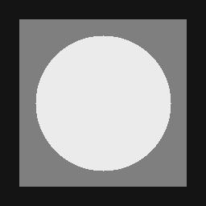

# Обработка и анализ изображений (МИСИС, 2025, весна)

## лабораторная 1

### часть 1

1. создайте при# Отчет по лабораторной работе №1
#### Фурмулировка задания: 1.2 добавьте в библиотеку semcv функцию

```
	std::string semcv::strid_from_mat(const cv::Mat& img, const int n) {
	std::string height = converting_numbers(img.rows, n);
	std::string width = converting_numbers(img.cols, n);
	std::string channels = std::to_string(img.channels());
	int type = img.type();
	std::string typeStr;
	uchar depth = type & CV_MAT_DEPTH_MASK;
	uchar chans = 1 + (type >> CV_CN_SHIFT);
	switch (depth) {
	case CV_8U:  typeStr = "uint08"; break;
	case CV_8S:  typeStr = "sint08"; break;
	case CV_16U: typeStr = "uint16"; break;
	case CV_16S: typeStr = "sint16"; break;
	case CV_32S: typeStr = "sint32"; break;
	case CV_32F: typeStr = "real32"; break;
	case CV_64F: typeStr = "real64"; break;
	default:     typeStr = "unknown"; break;
	}
	std::string result = width + 'x' + height + '.' + channels + '.' + typeStr;
	saveImage(img);
	createFile("output_images");
	return result;
}
```
где присутствуют фунции:
######	- converting_numbers(img.rows, n) - для задания XXXXX вида чисел параметров
######	- saveImage(img) - для сохранения изображений в форматах .png, .tiff, .jpg
######	- createFile() - записи .lst


 #### Фурмулировка задания: 2.4 добавьте в библиотеку semcv функцию get_list_of_file_paths

```
std::vector<std::filesystem::path> semcv::get_list_of_file_paths(const std::filesystem::path& path_lst) {
	std::vector<std::filesystem::path> paths;
	std::ifstream in(path_lst, std::ios_base::in);
	std::string line;
	while (getline(in, line)) {
	paths.push_back(std::filesystem::absolute(line));
	}
	in.close();
	std::cout << "###Images wrote in the file###" << std::endl;
	for (int i = 0; i < paths.size(); i++) {
		std::cout << paths[i] << std::endl;
	}
	return paths;
}
```


 
#### Фурмулировка задания: 2.4 тестовое консольное приложение task01-01
#### входные параметры:
#####  - путь к lst-файлу


 #### Формулировка задания: 3.1 Реализация генерации серого одноканального 8bpp
    
```
cv::Mat semcv::greyImage() {
	cv::Mat img(30, 768, CV_8U, cv::Scalar(0)); 
	int value = 0; 
	int width = 768; 
	int height = 30; 
	int stripeWidth = 3; 

	for (int col = 0; col < width; col += stripeWidth) {
		for (int i = 0; i < stripeWidth; i++) {
			for (int row = 0; row < height; row++) {
				img.at<uchar>(row, col + i) = static_cast<uchar>(value);
			}
		}
		value++; 
	}

	cv::namedWindow("Striped Image", cv::WINDOW_AUTOSIZE);
	cv::imshow("Striped Image", img);
	cv::waitKey(0);
	return img;
}
```


 #### Формулировка задания: 3.2 Функция гаммы коррекции серого одноканального 8bpp->8bpp изображения
 ```
 cv::Mat semcv::gammaCorr(const cv::Mat& img, double& gamma) {
	cv::Mat normalized;
	img.convertTo(normalized, CV_32F, 1.0 / 255.0);
	cv::Mat gammaCorrected;
	cv::pow(normalized, gamma, gammaCorrected);
	gammaCorrected.convertTo(gammaCorrected, CV_8U, 255.0);

	return gammaCorrected;
}
```
 #### Формулировка задания: 3.3 Создание тестового консольного приложения, которое создает вертикальный коллаж из серых изображений, к которым применили гамма коррекцию
 


ватное хранилище на github с именем по формату misis2025s-3-secname-f-l, где secname - транслитерация фамилии, f - первая буква имени, l - первая буква отчества (все в нижнем регистре)
2. добавьте пользователя dvpsun в участники вашего проекта
3. сделайте минимальное дерево сборки с зависимостями от OpenCV (используйте find_package и  считайте, что в система бибилиотека установлена глобально)
4. добавьте в дерево сборки библиотеку semcv

### часть 2

1. добавьте в библиотеку semcv функцию 
```cpp
std::string strid_from_mat(const cv::Mat& img, const int n = 4)
```
которая в качестве параметров получает  
  * img - изображение (cv::Mat)  
  * n - число цифр (с ведущими нулями) для размеров, умолчательно 4  

возвращает строку-описатель (std::string) вида WWWWxHHHH.C.TYPE\\  
  * WWWW - ширина - n цифр (с ведущими нулями)  
  * HHHH - высота - n цифр (с ведущими нулями)  
  * C - число каналов - 1 цифра  
  * TYPE - строка описание типа в канале (uint08, sint08, uint16, sint16, uint32, sint32, real32, real64)  
2.сгенерируйте и сохраните в одну папку тестовые изображения всех возможных форматов в виде файлов в форматах хранения png, tiff и jpg  
3.рядом с изображениями разместите текстовый файл-список task01.lst, в каждой строке которого содержится имя одного файла тестового изображения из текущей папки  
4.добавьте в библиотеку semcv функцию 
```cpp
std::vector<std::filesystem::path> get_list_of_file_paths(const std::filesystem::path& path_lst)
```
которая  
  * получает на вход путь к lst-файлу
  * возвращает массив полных путей к файлам, перечисленным в lst-файле 
5. напишите тестовое консольное приложение task01-01, которое получает в качестве параметра путь к lst-файлу и печатает протокол соответствия имен файлов формату хранящегося в них растру (формат отчета на каждой строке имя файла и через табуляцию 'good' или 'bad, should be XXXXXX', где XXXXXX - та строка-описатель, которая должна быть)

### часть 3
1. добавьте функцию генерации серого одноканального 8bpp изображения размером 768x30, состоящего из вертикальных полосок ширины 3px и значениями от 0 до 255
2. добавьте функцию гаммы коррекции серого одноканального 8bpp->8bpp изображения
3. напишите тестовое консольное приложение task01-02, которое делает вертикальный коллаж из изображений п.1 и п.2 для $\gamma=1.8,2.0,2.2,2.4,2.6$ и сохраняет его по указанному пути в виде png-файла

## лабораторная 2

1. добавьте в библиотеку semcv функцию 
```cpp
cv::Mat gen_tgtimg00(const int lev0, const int lev1, const int lev2)
```
для генерации тестового изображения (серое одоканальное 8bpp) с тремя уровнями яркости (lev0, lev1, lev2)


геометрические размеры:
  * 256 - сторона изображения
  * 209 - сторона внутреннего квадрата
  * 83 - радиус круга
 
2. добавьте в библиотеку semcv функцию для зашумления заданного изображения (серое одоканальное 8bpp) 
```cpp
cv::Mat add_noise_gau(const cv::Mat& img, const int std)
``` 
аддитивным нормальным несмещенным шумом с заданным значением среднеквадратичного отклонения std

3. напишите тестовое консольное приложение task02, которое 
  * генерирует тестовые изображения для 4-х наборов уровней яркости фона-квадрата-круга ([0,127,255], [20,127,235], [55,127,200], [90,127,165])
  * склеивает (по горизонтали) тестовые изображения слева-направо в одно
  * получает зашумленные изображения (склейки) для трех значений std (3, 7, 15)
  * склеивает (по вертикали) исходные и зашумленные в одно
  * сохраняет итоговый результат в файл по указанному в качестве параметра командной строки пути

4. проведите анализ вашего результата и напишите короткий отчет
